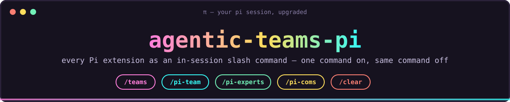
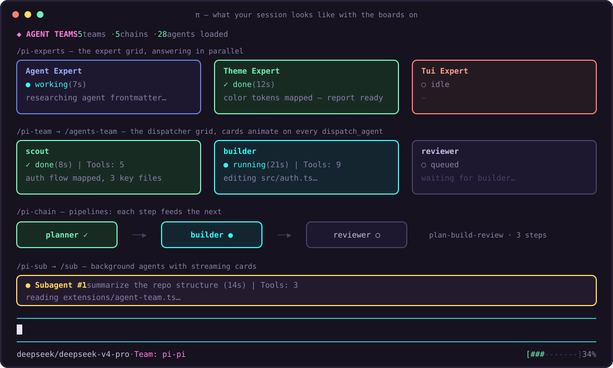
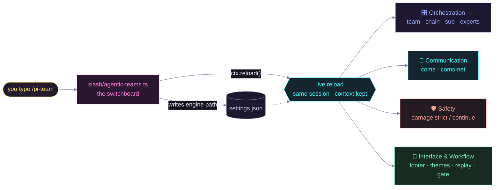
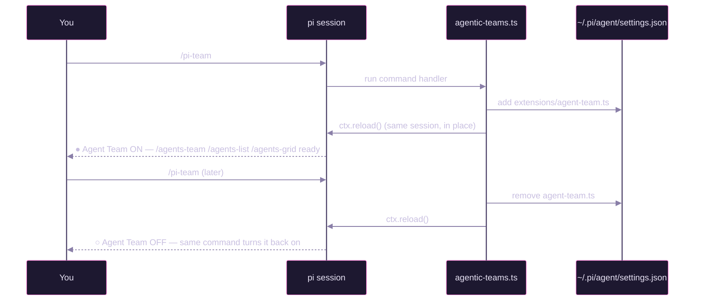
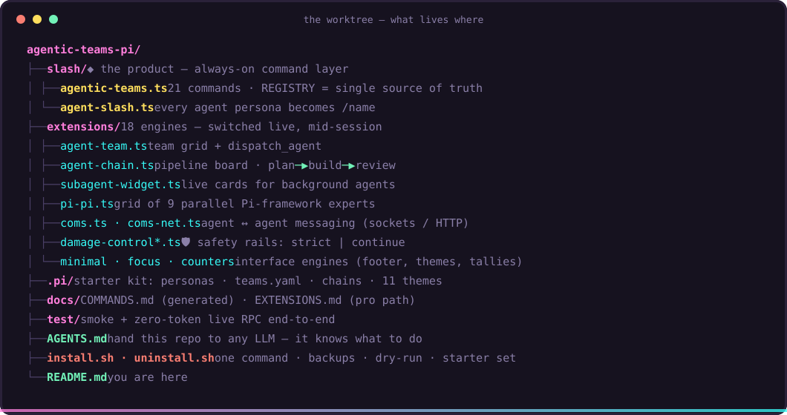

<div align="center">



[](LICENSE)
[](https://github.com/badlogic/pi-mono)
[](docs/EXTENSIONS.md)
[](docs/COMMANDS.md)
[](test)

</div>

**Every Pi extension as an in-session slash command.** Agent teams, pipelines, subagents,
peer-to-peer coms and safety rails — activated and deactivated with a single command,
inside the session you are already in. No relaunch. No `-e` flags. No restart.

Built on the [Pi coding agent](https://github.com/badlogic/pi-mono) · engines from
[pi-vs-claude-code](https://github.com/disler/pi-vs-claude-code) by IndyDevDan (MIT).

---

## The problem this solves

Pi extensions are powerful, but they load at startup:

```
# before — want the agent team? leave your session and start over:
pi -e extensions/agent-team.ts -e extensions/theme-cycler.ts
```

Change your mind mid-session — need subagents instead, or want the safety rails off —
and it's quit, retype flags, relaunch, lose your flow.

**agentic-teams-pi turns every extension into a switch:**

```
# after — inside the session you already have:
/pi-team        → team dispatcher armed, grid dashboard live
/pi-team        → same command again: disarmed, gone
/teams          → see every team, chain and agent you have, right now
/pi-off         → everything off, plain pi again
```

Under the hood, each command writes the engine into `~/.pi/agent/settings.json` and calls
Pi's extension reload — so the engine's commands, tools and widgets appear (or disappear)
**live in the current session**, and the choice persists for future sessions until you
toggle it back.

## What your session looks like

Live boards for everything: expert grids answering in parallel, dispatcher cards animating
on every `dispatch_agent`, pipeline steps lighting up, subagent cards streaming their work:

<div align="center">

</div>

---

## Two ways to use this repo

| Path | For | You get |
| --- | --- | --- |
| **A. Slash commands** — default | everyone | Every feature as an in-session switch: `/pi-team` on, `/pi-team` off. Installed once, available in every pi session. |
| **B. Raw extensions** — pro | users who want the classic `-e` workflow | The 18 engines, launched and stacked by hand, no slash layer. Full reference: [docs/EXTENSIONS.md](docs/EXTENSIONS.md) |

> 🤖 **Installing with an AI agent?** Point it at this repo and tell it what you want —
> it will find [AGENTS.md](AGENTS.md), which tells any LLM exactly how to install and
> verify either path. Saying nothing special gets you Path A.

---

## Path A — Quickstart (slash commands)

**Run inside this repo** (project settings load the slash layer for sessions started here):

```bash
git clone https://github.com/devclone20/agentic-teams-pi.git
cd agentic-teams-pi
pi
```

> Toggles are saved to your global `~/.pi/agent/settings.json` — that is what makes them
> survive into your next session. `/pi-off` (or `./uninstall.sh`) cleans them out.
> Two engines (`/pi-team`, `/pi-chain`) read YAML and need a one-time `bun install`
> (or `npm install`) in the clone when used in-repo without the global install.

**Or install globally** (commands available in every pi session, in any directory):

```bash
./install.sh      # copies engines to ~/.pi/agent/agentic-teams + wires settings.json
pi                # anywhere
```

A fresh install also enables the **visual starter set** — team grid, expert grid, chains
board, subagent cards and the minimal footer — so your first session already shows the
boards (skip it with `n` at the prompt, or trim it any time: each feature's own command
turns it off, `/pi-off` turns off everything). Re-installs never touch your toggles.

Then type:

```
/teams
```

and the roster board appears — every team, chain and agent you own, plus how to arm them.

## Path B — Quickstart (pro, extensions by hand)

```bash
git clone https://github.com/devclone20/agentic-teams-pi.git
cd agentic-teams-pi
pi -e extensions/agent-team.ts                                   # one engine
pi -e extensions/minimal.ts -e extensions/tool-counter-widget.ts # stacked
just ext-agent-team                                              # or the ready-made combos
```

"Off" is a launch without the flag; a persistent set is engine paths added to
`~/.pi/agent/settings.json` → `extensions` (exactly what the slash layer automates).
Per-engine flags, config files and env vars: **[docs/EXTENSIONS.md](docs/EXTENSIONS.md)**.

---

## Command table

Same command = on **and** off. `●` needs a config file (a starter set ships in `.pi/agents/`).
The always-current version of this table lives in [docs/COMMANDS.md](docs/COMMANDS.md) and
inside any session via `/commands-pi`.

### Meta — always available

| Command | What it does | What it shows |
| --- | --- | --- |
| `/teams` | The roster board — every team, chain and agent available right now | Teams with members, chains with step counts, agents as slash commands, engine state |
| `/pi-list` | Status board of every feature | Grouped board with ●/○ dots: what's on, what's available |
| `/commands-pi` | Full in-session reference | Every command + what it unlocks + personas + prompt templates |
| `/pi-themes [name]` | Instant theme switch (autocompletes names) | Theme picker, or direct switch |
| `/clear` | Wipe every message from the screen — fresh session | A clean terminal with only your agent boards and widgets |
| `/pi-off` | Panic button: deactivate every engine | Summary of what was turned off |

### Orchestration

| Command | What it does | What you see when active |
| --- | --- | --- |
| `/pi-team` ● | Loads the **team dispatcher** engine (dormant until you pick a team — then the primary agent delegates via `dispatch_agent`) | Live team grid above the editor; `/agents-team` picks & arms the team, `/agents-list`, `/agents-grid <1-6>` |
| `/pi-chain` ● | Loads the **pipeline** engine (each step's output feeds the next agent: `plan → build → review`) | Pipeline widget with step cards; `/chain` picks & arms the pipeline, `/chain-list` shows all |
| `/pi-sub` | **Background subagents**: offload tasks while you keep working | One live streaming widget per subagent; `/sub <task>`, `/subcont <id> <prompt>`, `/subrm <n>`, `/subclear` |
| `/pi-experts` ● | **Meta-agent experts**: parallel Pi-framework specialists answer research questions | Expert grid with per-expert progress; `/experts`, `/experts-grid <1-5>`, `query_experts` tool |

### Workflow

| Command | What it does | What you see when active |
| --- | --- | --- |
| `/pi-tilldone` | **Task discipline**: tools are blocked until a task list exists and one task is in progress | Persistent task list in the footer with live progress; `/tilldone` opens the overlay |
| `/pi-system` | Switch the **system prompt** to any discovered agent persona | Persona picker; active persona in the status line; `/system` |
| `/pi-cross` | Registers commands & skills from `.claude/`, `.gemini/`, `.codex/` dirs | Each discovered item becomes `/name` or `/skill:name` |
| `/pi-replay` | **Session timeline**: scrollable replay of everything that happened | Full-screen overlay: every user/assistant/tool step, timestamped; `/replay` |
| `/pi-gate` | **Purpose gate**: declare the session's single purpose before any work | Blocking prompt at activation, then a persistent purpose banner |

### Communication

| Command | What it does | What you see when active |
| --- | --- | --- |
| `/pi-coms` | **Peer-to-peer agents, same machine** (Unix sockets): two equal Pi agents talking, no hierarchy | Live peer-pool widget; `coms_list` / `coms_send` / `coms_get` / `coms_await` tools |
| `/pi-coms-net` | Same idea **across machines** via an HTTP/SSE hub | Peer pool across the network; `coms_net_*` tools; hub: `bun scripts/coms-net-server.ts` |

> The two coms engines share CLI flags and cannot run together — turning one on
> automatically turns the other off.

### Safety

| Command | What it does | What you see when active |
| --- | --- | --- |
| `/pi-damage strict` ● | Blocks dangerous bash & file access (from `damage-control-rules.yaml`) and **aborts** the turn | 🛡️ shield in the status line; blocked calls reported |
| `/pi-damage continue` ● | Same rules, but the agent **keeps working** with actionable feedback | Same shield; the turn adapts instead of dying |
| `/pi-damage off` | Rails off | — |

### Interface

| Command | What it does | What you see when active |
| --- | --- | --- |
| `/pi-focus` | Distraction-free mode — again to restore | Nothing. That's the point |
| `/pi-minimal` | Compact footer | `deepseek-v4  [###-------] 30%` |
| `/pi-counter footer` | Rich two-line stats footer | Model, context, tokens, cost, branch + per-tool tally |
| `/pi-counter widget` | Tool tally as a colored widget above the editor | `Tools (12): bash 5 · read 4 · edit 3` |
| `/pi-cycler` | Theme hotkeys + `/theme` picker | 🎨 theme in status line; `ctrl+shift+x` / `ctrl+q` to cycle (hotkeys are terminal-dependent on macOS — see [docs/RESERVED_KEYS.md](docs/RESERVED_KEYS.md)) |

### Agents as commands

`slash/agent-slash.ts` gives **every agent persona its own slash command** — the fastest
way to fire a specialist at a task:

| You type | What happens |
| --- | --- |
| `/scout map the auth flow` | The `scout` persona runs as a one-shot pi subprocess; its report streams back into your conversation |
| `/builder implement the fix` | Same, with the `builder` persona |
| `/cc-<name> <task>` | Personas from `.claude/agents/` — prefixed `cc-` so they never collide |
| `/agents-slash-list` | Everything registered, grouped by source |

The starter roster: `scout` · `planner` · `builder` · `reviewer` · `documenter` ·
`red-team` · `plan-reviewer` · `bowser` (browser automation via the bundled `bowser`
skill + bash) + ten Pi-framework experts.

---

## How a toggle works

One switchboard, four engine families — a command flips the wiring and reloads in place:



And the full life of a switch — on, off, on again, always the same command:



Three properties fall out of this design:

- **Symmetric** — one command is the whole lifecycle: on, off, on again.
- **Persistent** — toggles survive into your next session until you change them.
- **Collision-proof** — engines are matched by filename, so a copy loaded from another
  directory is recognised and replaced, never doubled.

> Activation reloads the extension runtime in place. Your conversation and context are
> untouched, but live widgets (running subagents, chains in flight) reset — arm your
> engines before launching long-running work.

---

## Configure your teams

Teams and chains are plain YAML in `.pi/agents/` (project) or `~/.pi/agent/agents/` (global):

```yaml
# .pi/agents/teams.yaml — /agents-team picks one of these
frontend: [planner, builder, bowser]
quality:  [reviewer, red-team]
docs:     [scout, documenter]
```

```yaml
# .pi/agents/agent-chain.yaml — /chain runs one of these
plan-build-review:
  steps:
    - agent: planner
      prompt: "Plan this work: $INPUT"
    - agent: builder
      prompt: "Implement exactly this plan: $INPUT"
    - agent: reviewer
      prompt: "Review the result: $INPUT  (original ask: $ORIGINAL)"
```

Each persona is a Markdown file with frontmatter (`name`, `description`, `tools`) and the
system prompt as body. Drop a new `.md` in the folder — it becomes a team member **and**
a `/name` slash command.

## Two agents talking to each other

```bash
# terminal 1                       # terminal 2
pi                                 pi
/pi-coms                           /pi-coms
```

Each side sees a live pool of peers. Ask one agent to `coms_send` a prompt to the other
and `coms_await` the reply — two equal agents, prompt → response → prompt, no hierarchy.
For different machines, start the hub (`bun scripts/coms-net-server.ts`) and use
`/pi-coms-net` instead.

---

## Project layout

<div align="center">

</div>

Also in the tree: `scripts/coms-net-server.ts` (the HTTP/SSE hub for `/pi-coms-net`),
`scripts/gen-commands.ts` (regenerates docs/COMMANDS.md from the REGISTRY) and the
`justfile` (`just pi · just smoke · just rpc-check · just gen-docs · just ext-*`).

## Requirements

| Tool | Needed for | Install |
| --- | --- | --- |
| **pi** ≥ 0.82 | everything | `npm i -g @earendil-works/pi-coding-agent` |
| **node** | `install.sh` settings edit | ships with pi's install |
| **bun** | tests, docs generation, coms-net hub (optional otherwise) | [bun.sh](https://bun.sh) |
| **just** | task runner (optional) | `brew install just` |

API keys: Pi does not auto-load `.env` — copy `.env.sample` to `.env` and `source .env`
before launching, or configure providers with `/login` inside pi.

## Verifying

```bash
just smoke       # static: every module loads, zero collisions, every engine covered
just rpc-check   # live: boots pi in RPC mode in a throwaway HOME, flips real toggles
```

---

## Credits

- **[IndyDevDan](https://www.youtube.com/@indydevdan)** — the 19 engines began life in
  [pi-vs-claude-code](https://github.com/disler/pi-vs-claude-code) (MIT). Watch
  [Pi Coding Agent: The Only Claude Code Competitor](https://youtu.be/f8cfH5XX-XU).
- **[Mario Zechner](https://x.com/badlogicgames)** — the [Pi coding agent](https://github.com/badlogic/pi-mono) itself.
- **Alex Rider (devclone20)** — the in-session slash-command layer this repo exists for.

MIT — see [LICENSE](LICENSE).
